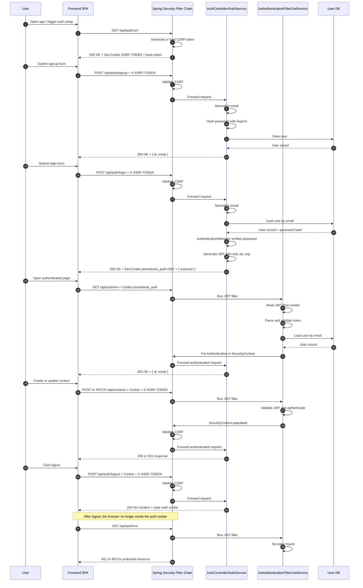

# Authentication flow diagram

```mermaid
sequenceDiagram
    autonumber
    participant U as User
    participant F as Frontend SPA
    participant B as Spring Security Filter Chain
    participant A as AuthController/AuthService
    participant J as JwtAuthenticationFilter/JwtService
    participant D as User DB

    U->>F: Open app / trigger auth setup
    F->>B: GET /api/auth/csrf
    B->>B: Generate or load CSRF token
    B-->>F: 200 OK + Set-Cookie XSRF-TOKEN + body token

    U->>F: Submit signup form
    F->>B: POST /api/auth/signup + X-XSRF-TOKEN
    B->>B: Validate CSRF
    B->>A: Forward request
    A->>A: Normalize email
    A->>A: Hash password with Argon2
    A->>D: Save user
    D-->>A: User saved
    A-->>F: 200 OK + { id, email }

    U->>F: Submit login form
    F->>B: POST /api/auth/login + X-XSRF-TOKEN
    B->>B: Validate CSRF
    B->>A: Forward request
    A->>A: Normalize email
    A->>D: Load user by email
    D-->>A: User record + password hash
    A->>A: AuthenticationManager verifies password
    A->>A: Generate JWT with sub, iat, exp
    A-->>F: 200 OK + Set-Cookie phonebook_auth=JWT + { expiresIn }

    U->>F: Open authenticated page
    F->>B: GET /api/auth/me + Cookie phonebook_auth
    B->>J: Run JWT filter
    J->>J: Read JWT from cookie
    J->>J: Parse and validate token
    J->>D: Load user by email
    D-->>J: User record
    J->>B: Put Authentication in SecurityContext
    B->>A: Forward authenticated request
    A-->>F: 200 OK + { id, email }

    U->>F: Create or update contact
    F->>B: POST or PATCH /api/contacts + Cookie + X-XSRF-TOKEN
    B->>J: Run JWT filter
    J->>J: Validate JWT and authenticate
    J->>B: SecurityContext populated
    B->>B: Validate CSRF
    B->>A: Forward authenticated request
    A-->>F: 200 or 201 response

    U->>F: Click logout
    F->>B: POST /api/auth/logout + Cookie + X-XSRF-TOKEN
    B->>B: Validate CSRF
    B->>A: Forward request
    A-->>F: 204 No Content + clear auth cookie

    Note over F,B: After logout, the browser no longer sends the auth cookie

    F->>B: GET /api/auth/me
    B->>J: Run JWT filter
    J->>J: No token found
    B-->>F: 401 or 403 for protected resource
```
